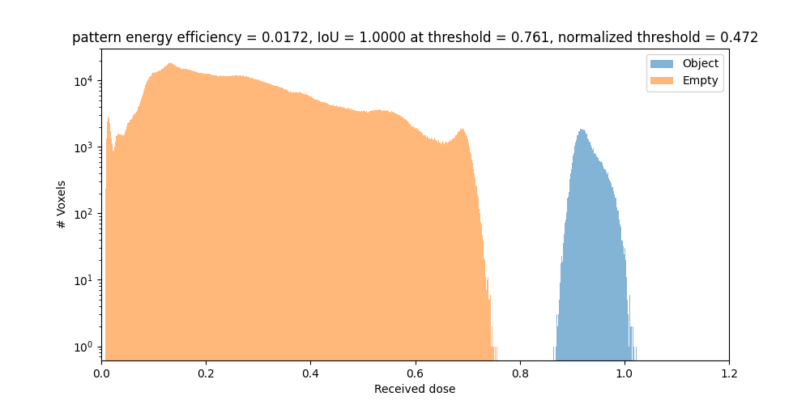
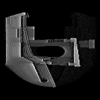
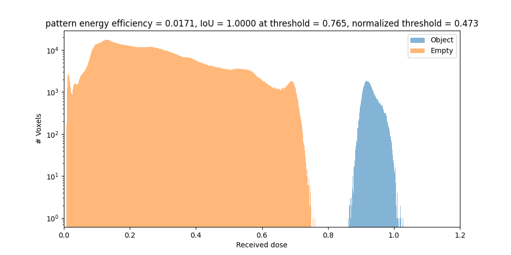
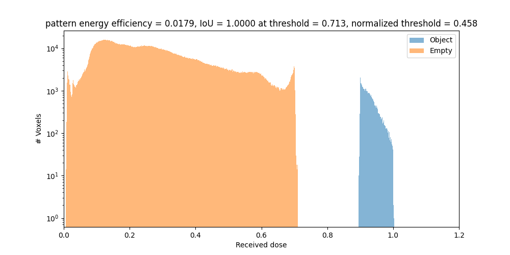
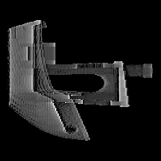
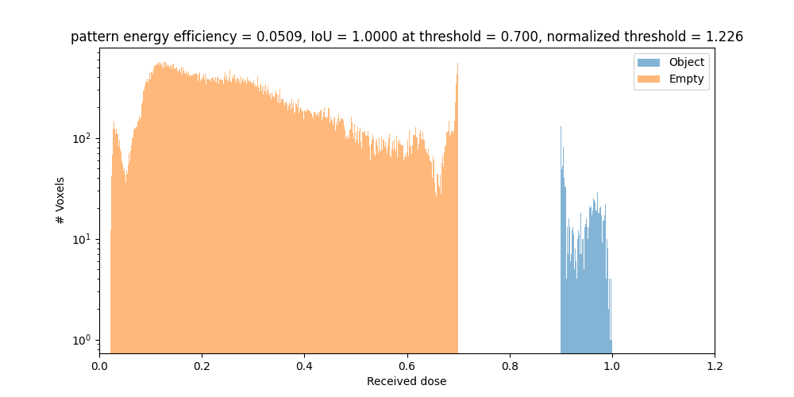

.. _performance_tips:

Performance Tips
================

In principle, optimizing TVAM patterns has a computational complexity cost of 

.. math::

   \mathcal{O}(N_x \cdot N_y \cdot N_{s,x} \cdot N_{s,y}  \cdot N_\text{angles} \cdot \mathrm{spp}) \approx \mathcal{O}(N^5 \cdot \mathrm{spp})

where :math:`N_x`, :math:`N_y` are the number of pixels vertically and horizontally on the detector.
:math:`N_{s,x}`, :math:`N_{s,y}` are the number of voxels in the 3D printed object space  in each spatial dimension.
:math:`N_\text{angles}` is the number of projection angles, and :math:`\mathrm{spp}` is the number of samples per pixel used to render each projection.
Since all these parameters need to be sufficiently high to get good quality prints, the total computation time can be significant. 
For example, to obtain a two times better resolution in each dimension, the computation time increases by a factor of 32.
For a factor of 4 increase in resolution, the computation time increases by a factor of 1024!

In practice, however, several optimizations can be used to significantly reduce the computation time.

We would definitely recommend to try our ``filter_radon``, ``transmission_only``, and reducing ``spp`` first, as they usually provide the largest speedup with minimal impact on quality.
It is a good idea to try each of these optimizations one by one, and check the impact on both performance and quality on the patterns

Note, all patterns shown below have a gamma correction of 0.5 applied to enhance visibility.

Simple Example
----------------
Let's consider this benchy example. 
On Ubuntu 24.04 and a NVIDIA RTX 3060 GPU, the following configuration file will run in about 2min15s.

.. raw:: html

   

   
<a>Simple example</a>

.. code-block:: json

    {
        "vial": {
            "type": "cylindrical",
            "r_int": 7.5,
            "r_ext": 8.0,
            "ior": 1.54,
            "medium": {
                "ior": 1.49,
                "phase": {"type": "rayleigh"},
                "extinction": 0.1,
                "albedo": 0.0
            }
        },
        "projector": {
            "type": "collimated",
            "n_patterns": 300,
            "resx": 200,
            "resy": 200,
            "pixel_size": 20e-3,
            "motion": "circular",
            "distance": 20
        },
        "sensor": {
            "type": "dda",
            "scalex": 3,
            "scaley": 3,
            "scalez": 3,
            "film": {
                "type": "vfilm",
                "resx": 150,
                "resy": 150,
                "resz": 150
            }
        },
        "target": {
            "filename": "benchy.ply",
            "size": 3.0
        },
        "loss": {
            "type": "threshold",
            "tl": 0.7,
            "tu": 0.9
        },
        "transmission_only": false,
        "regular_sampling": false,
        "filter_radon": false,
        "n_steps": 40,
        "spp": 8,
        "spp_ref": 8,
        "spp_grad": 8 
    }

.. raw:: html

   

   

Apply Filter Radon 
------------------
``filter_radon`` checks which pixels are actually contributing to the final image, and only renders those. That means, pixels which do not intersect the target at any angle are not rendered at all. This can significantly reduce the number of rays that need to be traced, especially for targets which do not fill the DMD entirely. Let's try it for the benchy example above.
So that means also, if the target is only 3mm but your DMD is 20mm wide, a lot of pixels will not contribute to the final image. The speedup can be often 2-10x or more, depending on the target size and shape.
In this case, since our DMD is quite small, the new configuration file will run in about 1min05s.

.. raw:: html

   

   
<a>Simple example</a>

.. code-block:: json

    {
        "vial": {
            "type": "cylindrical",
            "r_int": 7.5,
            "r_ext": 8.0,
            "ior": 1.54,
            "medium": {
                "ior": 1.49,
                "phase": {"type": "rayleigh"},
                "extinction": 0.1,
                "albedo": 0.0
            }
        },
        "projector": {
            "type": "collimated",
            "n_patterns": 300,
            "resx": 200,
            "resy": 200,
            "pixel_size": 20e-3,
            "motion": "circular",
            "distance": 20
        },
        "sensor": {
            "type": "dda",
            "scalex": 3,
            "scaley": 3,
            "scalez": 3,
            "film": {
                "type": "vfilm",
                "resx": 150,
                "resy": 150,
                "resz": 150
            }
        },
        "target": {
            "filename": "benchy.ply",
            "size": 3.0
        },
        "loss": {
            "type": "threshold",
            "tl": 0.7,
            "tu": 0.9
        },
        "transmission_only": false,
        "regular_sampling": false,
        "filter_radon": true,
        "n_steps": 40,
        "spp": 8,
        "spp_ref": 8,
        "spp_grad": 8 
    }

.. raw:: html

   

Sample Transmission Only
------------------------
For a round vial, as in this case, backreflected light is minimal. Therefore, we can enable
``transmission_only`` to only consider light that goes straight through the target. This will further reduce the number of rays that need to be traced, and the new configuration file will run in about 0m44s.

.. raw:: html

   

   
<a>Simple example</a>

.. code-block:: json

    {
        "vial": {
            "type": "cylindrical",
            "r_int": 7.5,
            "r_ext": 8.0,
            "ior": 1.54,
            "medium": {
                "ior": 1.49,
                "phase": {"type": "rayleigh"},
                "extinction": 0.1,
                "albedo": 0.0
            }
        },
        "projector": {
            "type": "collimated",
            "n_patterns": 300,
            "resx": 200,
            "resy": 200,
            "pixel_size": 20e-3,
            "motion": "circular",
            "distance": 20
        },
        "sensor": {
            "type": "dda",
            "scalex": 3,
            "scaley": 3,
            "scalez": 3,
            "film": {
                "type": "vfilm",
                "resx": 150,
                "resy": 150,
                "resz": 150
            }
        },
        "target": {
            "filename": "benchy.ply",
            "size": 3.0
        },
        "loss": {
            "type": "threshold",
            "tl": 0.7,
            "tu": 0.9
        },
        "transmission_only": true,
        "regular_sampling": false,
        "filter_radon": true,
        "n_steps": 40,
        "spp": 8,
        "spp_ref": 8,
        "spp_grad": 8 
    }

.. raw:: html

   

.. image:: resources/performance/transmission.png
  :width: 200

Reducing spp
----------------
Finally, we can try to reduce the number of samples per pixel (spp) used during the optimization. In the case of no scattering or no blurred projection (for example :ref:`real lens projector <lens_projector>`), choosing a ``spp`` of 1 is often sufficient to get good results. We also need to reduce ``spp_grad`` to 1, which is the number of samples per pixel used to compute the gradient during optimization.
Since we use ``spp_ref`` only for the final reference rendering, we can keep them at 8 to check if the optimization is converging correctly.
We can also turn on ``regular_sampling`` which samples a ray from the center position of each pixel, instead of randomly sampling within the pixel area. This reduces variance and can help convergence when using low ``spp``.
With this we could reduce the rendering time to about 0m08s

.. raw:: html

   

   
<a>Simple example</a>

.. code-block:: json

    {
        "vial": {
            "type": "cylindrical",
            "r_int": 7.5,
            "r_ext": 8.0,
            "ior": 1.54,
            "medium": {
                "ior": 1.49,
                "phase": {"type": "rayleigh"},
                "extinction": 0.1,
                "albedo": 0.0
            }
        },
        "projector": {
            "type": "collimated",
            "n_patterns": 300,
            "resx": 200,
            "resy": 200,
            "pixel_size": 20e-3,
            "motion": "circular",
            "distance": 20
        },
        "sensor": {
            "type": "dda",
            "scalex": 3,
            "scaley": 3,
            "scalez": 3,
            "film": {
                "type": "vfilm",
                "resx": 150,
                "resy": 150,
                "resz": 150
            }
        },
        "target": {
            "filename": "benchy.ply",
            "size": 3.0
        },
        "loss": {
            "type": "threshold",
            "tl": 0.7,
            "tu": 0.9
        },
        "transmission_only": true,
        "regular_sampling": true,
        "filter_radon": true,
        "n_steps": 40,
        "spp": 1,
        "spp_ref": 8,
        "spp_grad": 1 
    }

.. raw:: html

   

Reducing sensor resolution
--------------------------
As a last resort, if your printing quality is expected to be suboptimal anway or your target is very simple, you can also simply reduce the sampling of the object space to a low value.
For example, setting the sensor resolution to 50x50x50 will further reduce the rendering time to about 0m02s.

.. raw:: html

   

   
<a>Simple example</a>

.. code-block:: json

    {
        "vial": {
            "type": "cylindrical",
            "r_int": 7.5,
            "r_ext": 8.0,
            "ior": 1.54,
            "medium": {
                "ior": 1.49,
                "phase": {"type": "rayleigh"},
                "extinction": 0.1,
                "albedo": 0.0
            }
        },
        "projector": {
            "type": "collimated",
            "n_patterns": 300,
            "resx": 200,
            "resy": 200,
            "pixel_size": 20e-3,
            "motion": "circular",
            "distance": 20
        },
        "sensor": {
            "type": "dda",
            "scalex": 3,
            "scaley": 3,
            "scalez": 3,
            "film": {
                "type": "vfilm",
                "resx": 50,
                "resy": 50,
                "resz": 50
            }
        },
        "target": {
            "filename": "benchy.ply",
            "size": 3.0
        },
        "loss": {
            "type": "threshold",
            "tl": 0.7,
            "tu": 0.9
        },
        "transmission_only": true,
        "regular_sampling": true,
        "filter_radon": true,
        "n_steps": 40,
        "spp": 1,
        "spp_ref": 8,
        "spp_grad": 1 
    }

.. raw:: html

   

Radical different approach?
---------------------------
What about FFT based methods as in CT reconstruction? 
First, in CT reconstruction, the community uses NFFT methods which provide less speed-up that classical FFT, because the sampling is not uniform.
Second, in TVAM, we have a complex light transport with refraction, reflection and potentially scattering. This makes it very hard to use FFT based methods.
Even absorption makes the light transport non-trivial to model with FFT methods (we are not aware of methods to model the attenuated Radon transform with FFTs).
Finally, Dr.TVAM is designed to be flexible and extensible, allowing users to easily adapt it to their specific TVAM setups and requirements. This flexibility is not achievable with FFT based methods.
